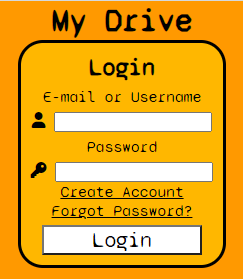
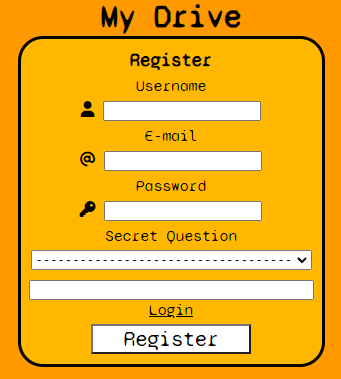
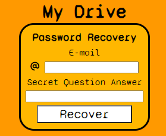

# Drive

App where you can upload files to server running on node js and then view/download the files from your browser.

The files that are now working better are Images and Videos.

# Using the app

To use the app you will need to first clone the repository

```
git clone https://github.com/shrimp16/Drive.git
```

Then to start the server you have to go to the "SERVER" directory and run the command

```
node server.js
```

To start the web page it's up to you about what do you want to use, in my case, I used [http-server](https://www.npmjs.com/package/http-server) with the following command

```
http-server WEB-PAGE
```

# Technologies

- VSCode
- HTML
- CSS
- JavaScript
- jQuery
- Express.js
- FS.js
- Multer.js
- Http-server

# Screenshots


---

---

---

---

